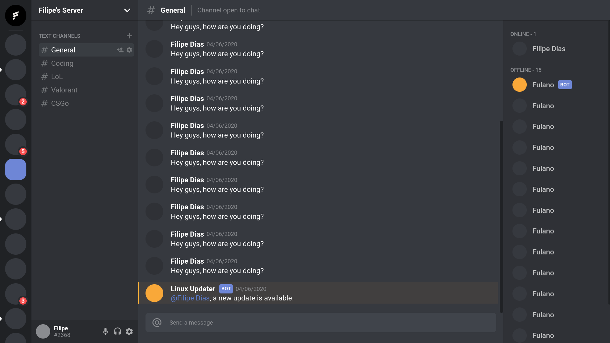

# Discord UI Clone

<p align="center">
  
  
</p>
<br>

This project is a Discord UI clone developed with [ReactJS](https://reactjs.org/), [Vite](https://vitejs.dev/) and [Typescript](https://www.typescriptlang.org/) to learn more about front end development. 

The main objectives of the project were to learn more about react projects structure, components segregation and UI styling. Grid layout was used to organize the UI components, and the [styled-components](https://styled-components.com/) and [styled-icons](https://styled-icons.dev/) library to create the components styles. 

<h1 align="center">
    
</h1>

## Technologies
- [ReactJS](https://reactjs.org/)
- [Vite](https://vitejs.dev/)
- [Typescript](https://www.typescriptlang.org/)
- [styled-components](https://styled-components.com/)
- [styled-icons](https://styled-icons.dev/)

## Getting started
Install the project dependencies:
```shell
$ yarn 
```

Start the project:
```shell
$ yarn dev 
```

## License
This project is licensed under the MIT. Consult the [LICENSE](LICENSE) for more information.
